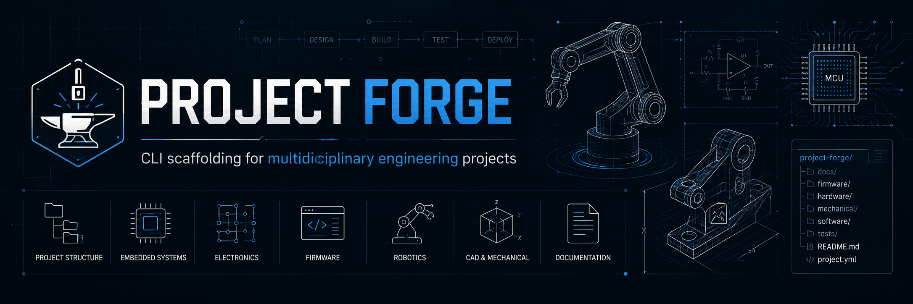

<p align="center">
  
</p>

# Project Forge

Project Forge is a command-line scaffolding tool for generating professional engineering project structures.

It is designed for multidisciplinary technical projects involving robotics, embedded systems, computer vision, electronics, firmware, CAD, testing, documentation and GitHub Pages portfolio integration.

The goal of Project Forge is to provide a clean, repeatable and documentation-first starting point for real engineering projects.

---

## Purpose

Engineering projects are rarely just code.

A complete technical project may include software, firmware, electronics, CAD files, documentation, test reports, media assets, data samples and decision records. Without a clear structure from the beginning, repositories can quickly become difficult to maintain, document and present professionally.

Project Forge solves this by generating a consistent engineering scaffold from predefined templates.

---

## Platform Strategy

Project Forge is intended to support different operating systems using native scripting tools:

```text id="qc3ejt"
Windows  → PowerShell
Linux    → Bash
```

The current version focuses on the Windows PowerShell implementation.

Linux support is planned through Bash scripts, not through PowerShell on Linux.

---

## Current Status

### Available Now

* Windows PowerShell CLI.
* Local PowerShell module installation.
* JSON-based project templates.
* Engineering project scaffold generation.
* `engineering-system` template.
* `decisions.md` files for technical decision tracking.

### Planned

* Bash-based Linux CLI.
* Equivalent Linux installation script.
* Shared template format between Windows and Linux.
* Consistent command behavior across platforms.
* Git initialization option.
* Template inspection command.
* Decision log automation.
* GitHub release installation workflow.

---

## Features

* CLI-based project generation.
* No Python or C++ runtime required.
* Native Windows implementation using PowerShell.
* Future Linux implementation using Bash.
* JSON-based project templates.
* Multidisciplinary engineering project scaffold generation.
* Dedicated folders for software, firmware, hardware, CAD, documentation, tests, media, data and website assets.
* `decisions.md` files for technical decision tracking in each major project area.
* Suitable for GitHub repositories, technical portfolios and engineering documentation workflows.

---

## Current Template

### `engineering-system`

A complete project structure for multidisciplinary engineering systems.

Generated structure:

```text id="5zqg3j"
project-name/
├── README.md
├── ROADMAP.md
├── CHANGELOG.md
├── .gitignore
├── decisions.md
│
├── docs/
│   ├── 00_project_overview.md
│   ├── 01_system_architecture.md
│   ├── 02_requirements.md
│   ├── 03_testing_validation.md
│   ├── decisions.md
│   ├── images/
│   └── diagrams/
│
├── software/
│   ├── README.md
│   ├── decisions.md
│   ├── edge_ai/
│   └── communication/
│
├── firmware/
│   ├── README.md
│   ├── decisions.md
│   └── esp32/
│
├── hardware/
│   ├── README.md
│   ├── decisions.md
│   ├── proteus/
│   ├── electronics/
│   ├── datasheets/
│   └── bom/
│
├── cad/
│   ├── README.md
│   ├── decisions.md
│   ├── native/
│   └── export/
│
├── data/
│   ├── README.md
│   ├── decisions.md
│   ├── sample_images/
│   └── annotations_example/
│
├── media/
│   ├── README.md
│   ├── decisions.md
│   ├── photos/
│   ├── renders/
│   ├── diagrams/
│   └── videos/
│
├── tests/
│   ├── decisions.md
│   ├── vision/
│   ├── electronics/
│   ├── firmware/
│   └── integration/
│
└── website/
    ├── README.md
    ├── decisions.md
    └── assets/
```

---

## Windows Installation

Clone the repository:

```powershell id="z3hzqr"
git clone https://github.com/Minoiu-Mihai/project-forge.git
cd project-forge
```

Install Project Forge as a local PowerShell module:

```powershell id="m30p41"
.\install.ps1
```

If script execution is blocked, run:

```powershell id="pn1msb"
Set-ExecutionPolicy -Scope Process -ExecutionPolicy Bypass
.\install.ps1
```

Import the module:

```powershell id="k4nxxs"
Import-Module ProjectForge -Force
```

Test the installation:

```powershell id="iq7qq6"
project-forge list-templates
```

---

## Windows Usage

List available templates:

```powershell id="f3hwzl"
project-forge list-templates
```

Create a new engineering project:

```powershell id="30025z"
project-forge create agro-ia -Template engineering-system
```

Create a project in a specific path:

```powershell id="4gyv4n"
project-forge create ..\agro-ia -Template engineering-system
```

---

## Linux Support

Linux support is planned through a native Bash implementation.

The intended future usage will be:

```bash id="5te86o"
./project-forge.sh list-templates
```

and:

```bash id="6wlvk5"
./project-forge.sh create agro-ia --template engineering-system
```

The Linux version is not implemented in the current release.

The goal is to reuse the same JSON template format so that Windows PowerShell and Linux Bash generate equivalent project structures.

---

## Example Use Case

```powershell id="f1n8b6"
project-forge create agro-ia -Template engineering-system
```

This creates a complete engineering repository structure suitable for documenting a project involving:

* Computer vision
* Embedded AI
* Electronics
* Firmware
* CAD
* Hardware design
* Test validation
* Technical documentation
* GitHub Pages integration

---

## Decision Tracking

Project Forge generates `decisions.md` files in each major project area.

These files are intended to record relevant technical decisions over time, such as:

* Why a specific CAD format was selected.
* Why a microcontroller was chosen.
* Why a specific communication protocol was used.
* Why a hardware architecture was accepted or rejected.
* Why a software or firmware design approach was adopted.

Future versions may include append-only decision management commands.

Example future command:

```powershell id="iplfmt"
project-forge add-decision -Scope hardware -Title "Use ESP32 as low-level controller"
```

The intended decision philosophy is:

```text id="kes63r"
Decisions are not deleted or rewritten.
New decisions are appended.
Superseded decisions remain traceable.
```

---

## Repository Structure

```text id="tz8my7"
project-forge/
├── ProjectForge.ps1
├── ProjectForge.psm1
├── install.ps1
│
├── templates/
│   └── engineering-system/
│       └── template.json
│
├── docs/
├── examples/
├── scripts/
│   ├── windows/
│   └── linux/
│
├── tests/
├── README.md
├── LICENSE
├── CHANGELOG.md
└── ROADMAP.md
```

---

## Roadmap

### v0.1.0

* Windows PowerShell CLI.
* Local PowerShell module installation.
* JSON-based templates.
* `engineering-system` scaffold.
* `decisions.md` generation.

### v0.2.0

* Template file content support.
* Improved generated README files.
* Improved generated decision logs.
* Template inspection command.

### v0.3.0

* Native Bash implementation for Linux.
* Linux installation script.
* Equivalent Linux command interface.
* Shared template support between Windows and Linux.

### Future

* Git initialization option.
* License generation.
* GitHub Pages structure option.
* Decision log automation.
* GitHub release installation workflow.
* Optional package distribution.

---

## Design Philosophy

Project Forge follows a documentation-first engineering philosophy.

A project should be understandable not only by its author, but also by collaborators, recruiters, technical reviewers and future maintainers.

The repository structure should reflect the real engineering scope of the project, not just its source code.

Project Forge is intended to support practical engineering workflows where software, hardware, firmware, CAD, tests and documentation coexist in the same repository.

---

## Requirements

### Current Windows Version

* Windows.
* PowerShell.
* Git is recommended for repository management.

### Planned Linux Version

* Linux.
* Bash.
* Git is recommended for repository management.

---

## Project Status

Project Forge is currently in early development.

The current release is functional for Windows PowerShell and can generate the initial structure for engineering repositories.

Linux Bash support is planned for a future release.

---

## Author

Mihai Minoiu
Industrial Design Engineer specialized in robotics perception, computer vision and embedded AI systems.

---

## License

This project is released under the MIT License.
